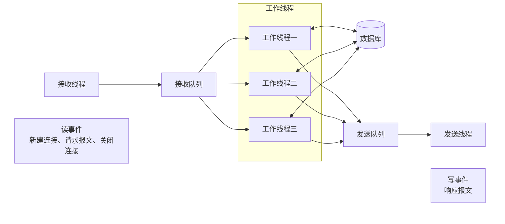

# A-项目描述

南京市气象局有上百个观测系统和业务系统，产生的观测数据和服务产品分散在各系统中，不方便共享。数据中心的功能是从各业务系统中采集数据，加工处理后，统一存储在Oracle数据库中，业务系统可以直连Oracle数据库，用SQL语句查询数据，也可以通过数据访问接口获取数据。

# B-各模块功能

## 1-数据抽取模块

1. 用于从数据源的数据库中抽取数据，生成xml文件
2. 这是一个通用的功能模块，通过配置脚本，就可以从不同的表中抽取数据
3. 支持全量抽取（每次抽取全部的数据）和增量抽取（每次只抽取新增的数据）
4. 支持Oracle、MySQL和SQL Server数据库。 本人做的是Oracle数据库，其它数据库的部分由有其他同学和师兄负责。

## 2-基于ftp协议的文件传输模块

1. 采用ftp协议，从ftp服务端下载/上传文件；
2. 这是一个通用的功能模块，通过配置脚本，就可以实现文件下载/上传任务；
3. 把开源的ftp客户端库ftplib.c封装成C++的类，使用起来更方便；
4. 支持增量传输的功能，每次只下载/上传新增的文件；
5. 适用于不同的业务系统之间传输文件。

## 3-基于tcp协议的文件传输模块

1. 自定义tcp通讯协议，实现了文件传输的服务端和客户端程序，支持文件下载/上传功能。
2. 这是一个通用的功能模块，通过配置脚本，就可以实现文件下载/上传任务；
3. 采用了异步通讯的方式，传输文件的效率非常高，远超过ftp协议；
4. 支持增量传输的功能，每次只下载/上传新增的文件；
5. 适用于同一个业务系统的多个服务器之间传输文件。

## 4-数据入库模块

1. 把数据抽取模块和数据处理模块生成的xml文件存储到Oracle数据库中；
2. 这是一个通用的功能模块，通过配置脚本，就可以实现不同种类数据的入库；
3. 根据xml文件名识别数据种类（需要入库的表），查询Oracle的数据字典，得到表的字段名，用字段名解析xml文件，获取数据，把数据入库到表中。

## 5-数据管理模块

1. 大部分的数据可分为热数据和冷数据，在气象行业中，历史数据属于冷数据，数据管理模块的功能是把冷数据删除、备份或归档。
2. 数据管理是通用的功能模块，通过配置脚本，就可以实现对不同数据表的管理。

## 6-数据同步模块

数据中心的数据库是一个集群，核心数据库采用RAC，应用数据库是若干个单实例，核心数据库负责处理数据，应用数据库负责提供数据服务。

1. 数据同步是指把核心数据库中的数据同步到应用数据库中；
2. 这是一个通用的功能模块，通过配置脚本，就可以实现不同表的同步；
3. 利用了Oracle的dblink和数据字典；
4. 支持刷新同步，全表刷新和按条件刷新；
5. 支持增量同步，只同步新增的数据；
6. 支持不同表结构的同步（源表和目的表的表结构不同）；
7. 可以指定同步数据的条件。

## 7-数据处理模块和数据统计模块

略.

## 8-数据访问接口模块

1. 采用http协议，为业务系统提供数据服务；
2. 这是一个通用的功能，通过配置参数，就可以实现不同的数据访问接口；
3. 服务端程序采用了线程、线程通讯、管道、智能指针和epoll等技术；
4. 数据访问接口性能瓶颈在Oracle数据库，并发性能在3-5千/秒左右。
5. 服务端程序的总体结构如下：

